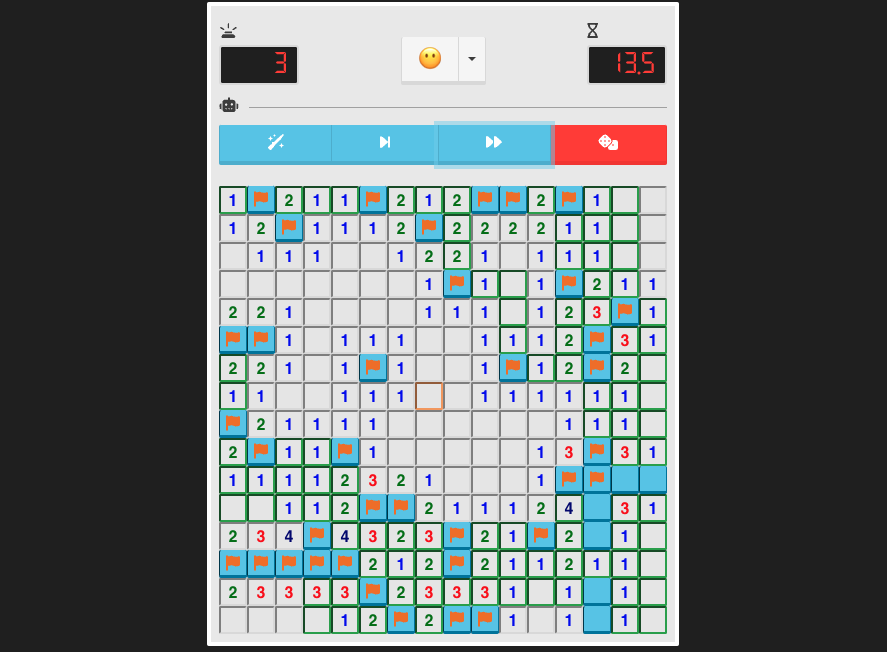

# minesweeper-ai



This is a long dream project of *mine* (ba dum tss) coming true and you can [play it here](https://virgs.github.io/mancala/)

I believe I can say minesweeper is the PC game I played the most throughout my life. Specially during adolescence.
If you were a kid in the 90s, the same way I was, I think you will agree with me when I say that our gaming options were not too sophisticated and our lack of options compared to nowadays didn't help either.  

With that being said and adding to the equation that I've always been into game development, it goes without saying that I had to code several different versions of my own minesweeper, including the [octagon/square pattern](https://github.com/virgs/octoQuadMineSweeper) (you can watch it [here](https://www.youtube.com/watch?v=PNmADfgnJjg)) and other ones long lost.  

Given my latest obsession with gaming artificial intelligence projects, it was just a matter of time until I come up with an AI for minesweeper.  

I've been thinkg about it for a really long time. I'd say that at least 15 years. Thought about several different strategies to solve it. From **fuzzy logic** to **neural networks**. None was good enough and gave me the confidence to actually make me want to spend some time to trying them.  

That was my reality until I found this one from [Harvard's *Introduction to Artificial Intelligence with Python*](https://cs50.harvard.edu/ai/2023/projects/1/minesweeper). More information about this approach [below](#artificial-intelligence-strategy). It got me instantly fascinated both by the simplicity and elegance that the solution has shown.  

I got what I needed.  

With no further ado, I present you my own approach of an **Artificial Intelligence** agent to play the classical version of **Minesweeper**.

## Goals

1. [**To write an artificial intelligence agent that can play any the classical minesweeper better than I do**](#artificial-intelligence-strategy). Ideally, it would have to be better than me. Modesty aside, this wouldn't be an easy task, since, as I mentioned earlier, I've been practicing it through most of my life. Once there is no way to ensure that (not because I'm THAT good), but this is something really hard to measure if you put the time factor aside (not really fair compare the time to solve a board between a human and a machine, right?), so I slightley changed the goal to be: **have a better ratio win rate than the numbers found [minesweeper.online](https://minesweeper.online/statistics)**. Check the [results](#results) at the end to check if this goal was achieved.

As I always do, a lot of different goals came with this project. Among them:

2. [Study webworkers](https://developer.mozilla.org/en-US/docs/Web/API/Web_Workers_API/Using_web_workers)
3. [Study WebAssembly](https://webassembly.org/) with [AssemblyScript](https://www.assemblyscript.org/)
4. [Study Pinia 🍍](https://pinia.vuejs.org/)
5. Last but not least important. **To have fun**. Yay!

## Minesweeper

If you not familiarized with the game concept, here's a quick overview about how it works.  
Minesweeper is a puzzle game that consists of a grid of cells, where some of the cells contain hidden "mines". Clicking on a cell that contains a mine detonates the mine, and causes the user to lose the game. Clicking on a "safe" cell (i.e., a cell that does not contain a mine) reveals a number that indicates how many neighboring cells – where a neighbor is a cell that is one square to the left, right, up, down, or diagonal from the given cell – contain a mine.

Using the right button click, you can flag a cell to prevent any accidental click, and, enable you to "chord". Chording in the action of clicking on a revealed cell indicating X and that has exactly X neighboring flagged cells. By doing this, you automatically reveal all the cell's neighbors. If you've flagged a neighboring safe cell, chording will make you lose the game.

A last disclaimer is needed because it's not unusual to see a minesweeper version that doesn't implement this behavior: the first cell ever clicked in a game will always open a clear area. It and its neighbors cannot have any mine. It makes it impossible to lose in the first click (ultimately always a guess) and maximizes the chance to provide you with enough information to stop guessing at the beginning.

This implementation provides you 4 AI actions:

1. *Hint*: tells you all inferable information given the current board configuration.
2. *Make one move*: reveal every **known** safe cell and flag every **known** mine cenn given the current board configuration.
3. *Keep playing until no guess is needed*: it essentialy keeps *making one move* repeatedly. It makes a move, then based on the updated board configuration, makes new inferences, makes another move and so on...
4. *Guess*: makes a [guess](#guesses). Since it's a guess and it's based on luck, you can lose by pressing it.

### Artificial Intelligence

How does the AI get to know what's a safe and what's a mine cell without any cheating? Well, my friend, it is all about two things: knowledge representation and inferences.

#### Knowledge representation

Consider this 4x4 board configuration where cells have been labeled with an identifying letter for the sake of discussion:

| 3 (A) | (B) | 2 (C) | (D) |
|---| ---|---|---|
| **(E)** | **(F)** | **(G)** | **(H)**|
| **3 (I)** | **(J)** | **(K)** | **(L)**|
| **1 (M)** | **(N)** | **(O)** | **0 (P)**|

There are 4 revealed cells: **A**, **C**, **I**, **M** and **P**.
Given this information, a logical player could conclude that there must be mines in the **B**, **E**, **F** cells and that there is no mine in the **D**, **G**, **H**, **K**, **L**, and **O** cell, for only in that case would the numerical labels on each of the other cells be accurate.

But how would a machine infer it? One way we could represent an AI’s knowledge about a Minesweeper game is by making each cell a propositional variable that is true if the cell contains a mine, and false otherwise.

What information does the AI have access to? Well, the AI would know every time a safe cell is clicked on and would get to see the number for that cell. We can represent the given board configuration using the **propositional logic notation** [explained here](https://cs50.harvard.edu/ai/2023/projects/1/minesweeper/).

In short, every logical sentence in this representation has two parts: a set of cells on the board that are involved in the sentence, and a number count, representing the count of how many of those cells are mines.

Why is this a useful representation? In part, it lends itself well to certain types of inference.

Thus, these propositional notation allows us to represent the 5 revealed cells we have with these 5 propositions:

1. **A** cell gives us {B, E, F} = 3 mines
1. **C** cell gives us {B, D, F, G, H} = 2 mines
1. **I** cell gives us {E, F, J, N} = 3 mines
1. **M** cell gives us {J, N} = 1 mine
1. **P** cell gives us {K, L, O} = 0 mines

The first above logical sentence says that out of cells **B**, **E**, and **F**, exactly 3 of them is a mine. And the same applies for the remaining sentences.

#### Inferences

Below we'll see how we can use this method of representing knowledge, to write an AI agent that can gather knowledge about the Minesweeper board, and hopefully win most of the games we play.

##### 1. All safe and all mines inference

Intuitively, we can infer from the 1st sentence ({B, E, F} = 3) that all **B**, **E**, and **F** must be mines. More generally, we can infer that any time the number of cells is equal to the count, all of that sentence’s cells must be mines.

Using the knowledge from the 5th sentence ({K, L, O} = 0), we can intuitively infer that all **K**, **L**, and **O** must be safe. By extension, any time we have a sentence whose count is 0, we know that all of that sentence’s cells must be safe.

In general, we’ll only want our sentences to be about cells that are not yet known to be either safe or mines. This means that, once we know whether a cell is a mine or not, we can update our sentences to simplify them and potentially draw new conclusions.

Now that we infered that **B**, **E**, and **F** are mines and **K**, **L**, and **O** are safe, we can update the unsatisfied sentences. Worth noting that sentences that have infered mines in it have to decrease the mine number as well.

2. **C** cell gives us {D, G, H} = 0 mines
3. **I** cell gives us {J, N} = 1 mine
4. **M** cell gives us {J, N} = 1 mine

Now the 2nd sentence allows us to infer that **D**, **G**, and **H** are not mine and no other sentence can be created.

##### 2. Subset inference

Consider just these two sentences our AI knows from a hypothetycal board configuration.

1. {A, B, C} = 1
2. {A, B, C, D, E} = 2

Logically, we could then infer a new piece of knowledge, that {D, E} = 1. After all, if two of **A**, **B**, **C**, **D**, and **E** are mines, and only one of **A**, **B**, and **C** are mines, then it stands to reason that exactly one of **D** and **E** must be the other mine.

    1. {A, B, C} = 1
    2. {A, B, C, D, E} = 2
    subtracting 1. from 2.
    3. {D, E} = 1

More generally, any time we have two sentences:

    set1 = count1
    set2 = count2

where set1 is a subset of set2, then we can construct the new sentence:

    set2 - set1 = count2 - count1

If we’re being even more clever, there’s one final type of inference we can do.

##### 3. Inequality difference inference

1. {B, C, D, E} = 3
2. {A, B, C} = 1

Note that they are not subset/superset of each other, but they do overlap {B, C}. Since this is an overlap, it's a subset of both propositions. If this is a subset from the first proposition, it's fair to say that it's a proposition that has **at most** (an inequality) 1 mine:

3. {B, C} <= 1.  

As previously said {B, C} is also a subset of the 2nd sentence, and combining this information with the [subset inference](#2-subset-inference) we just learned, we can to infer a new piece of knowledge:

    1. {B, C, D, E} = 3
    3. {B, C} <= 1
    Applying subset inference 1. - 3.
    4. {D, E} >= 2

Observe that {D, E} effectively is the difference set {B, C, D, E} - {A, B, C} = {D, E}

Once one letter can only have one mine, there's no way the sentence {D, E} has more than 2 mines.
So, we can conclude {D, E} = 2. Therefore **D** and **E** are mines. We can now update the 1st proposition ({B, C, D, E} = 3) with this information and get this new one: {B, C} = 1. Lastly, we subtract this last information from the 2nd proposition ({A, B, C} = 1) and get {A} = 0. Thus, **A** is a safe cell.

More generally, any time we have two sentences:

    set1 = count1
    set2 = count2

where count1 - count2 is equal to the number of cells the difference set (set1 - set2) has, then we can infer that every remaining cell is a mine.

## Results

If you didn't skip the goals section, or weren't getting distracted playing a game like, let's say minesweeper, you'll remember that the main goal was to have a better ratio win rate than the numbers found [minesweeper.online](https://minesweeper.online/statistics).

### Methodology

In order to generate the reports and be able to determin whether these numbers are good, I decided to compare against the stats on [minesweeper.online/statistics](https://minesweeper.online/statistics). I have no idea of how reliable they really are and one can say these numbers take beginners and speed-solvers in consideration. Honestly, I don't really care. It's better than nothing.

To compare against those stats number, I made the AI play the three default minesweeper levels:

- **Beginner:** 9x9 grid, 10 mines and ~0.123 mines density.
- **Intermediate:** 16x16 grid, 40 mines and ~0.156 mines density.
- **Expert:** 16x30 grid, 99 mines and ~0.206 mines density.

To generate the AI win ratio, the AI plays 2000 times every level. It play as safe as possible until no safe move is possible without any new information. When it finally runs out of safe moves, it guesses. And before going any further on reasults, the guessing factor must be addressed.

### Guesses

Unfortunatelly, given the very nature of the game, guesses are often required and make part of the game. So often that it's pretty much impossible to play one expert level game without any guessing at all. One can say it's a bad game design decision making the luck factor so important. And I second that, even though I've played it so many times. But what does this one have to say about games such as monopoly, rock-paper-scissor and all casino games?

I really didn't want to get too deep into guessing strategies. Even though they are about minimizing the luck factor, they're still about luck.

In order to decide which cell it guesses, the AI iterates over every cell of all currently known propositions and gathers this information about these cells:

1. Number of proposition the cell appears
2. The mine/cell ratio average this cell has.

Consider these two propositions:

1. {A, B, C, D} = 3
2. {C, D, E, F} = 2

Since the 1st proposition has 3 mines and 4 cells, it has a .75 mine/cell ratio. The second one has .5 ratio.  
Gathering the information the AI gets every time it has to guess, the AI comes up with:

- A: 1 appearence, .75 / 1 = .75 mine/cell ratio average
- B: 1 appearence, .75 / 1 = .75 mine/cell ratio average
- C: 2 appearence, (.75 + .5) / 2 = 0.625 mine/cell ratio average
- D: 2 appearence, (.75 + .5) / 2 = 0.625 mine/cell ratio average
- E: 1 appearence, .5 / 1 = .5 mine/cell ratio average
- F: 1 appearence, .5 / 1 = .5 mine/cell ratio average

Once this is done, it gets a cell with the **lowest mine/cell ratio average**. In this case, the AI would pick either **E** or **F**.

### Comparison table

| Level | [Minesweeper.online](https://minesweeper.online/statistics) | AI |
|--- | --- | --- |
| Beginner | 48% | [93.05%](./reports/main-proposition-less-relevant-arithmetic-avg-beginner-1702931793457.json) |
| Intermediate | 23% | [69.85%](./reports/main-proposition-less-relevant-arithmetic-avg-intermediate-1702931392867.json) |
| Expert | 2.7% | [29.55%](./reports/main-proposition-less-relevant-arithmetic-avg-expert-1702931496138.json) |

You can check these values yourself [here](./reports/) and suggest better approaches by coding it yourself.

## Code it yourself

If you want to, you can assemble your own guess strategy. To do so, you'd have to rewrite a really small potion of the code and put your ideas instead (link to the GuessMaker class).

### Project Setup

```sh
npm install
```

#### Compile and Hot-Reload for Development

```sh
npm run dev
```

#### Type-Check, Compile and Minify for Production

```sh
npm run build
```

#### Format

```sh
npm run format
```

## Sources

- [Algorithmic Approaches to Playing Minesweeper](https://cs50.harvard.edu/ai/2023/projects/1/minesweeper/)
- [Who wrote it?](http://honors.cs.umd.edu/reports/minesweeper.pdf)
- [Minesweeper.online](https://minesweeper.online/statistics)
